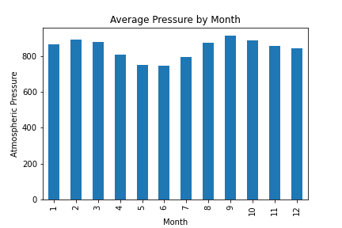
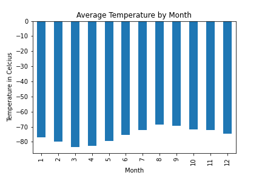
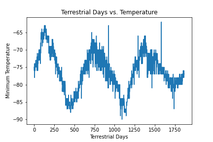

 
# Web-Scraping-Challenge

## Overview

In this repository, the user inspected two websites related to Mars and scraped them for information. Splinter and Beautiful Soup were utlized to execute the code and obtain the necessary information.

### Mars Nasa News Site
The Mars NASA news site (https://redplanetscience.com/) was inspected and scraped to exctract the titles and preivew text of various news articles. The results were then stored in a dictionary for ease of comprehension.

### Mars Weather Data
The Mars temperature data site (https://data-class-mars-challenge.s3.amazonaws.com/Mars/index.html) was also inspected and scraped to determine a few notable results:

1. How many months exist on Mars?
2. How many Martian days worth of data are in the data set?
3. What are the coldest and warmest months on Mars?
4. Which months have the lowest and highest atmospheric pressure on Mars?
5. How many terrestrial (Earth) days exist in  a Martian year?

The answer to these questions can be found within the code. THe visualizations of these answers are stored in the Images folder and added below!

## Analysis 

The utlization of jupyter notebook as well as visual studio code allows the user to scrape particular data from both sites answer the questions above. The HTML code was extracted using beautiful soup, the results were store in a dictionary as well as a pandas DataFrame. 

## Results              

